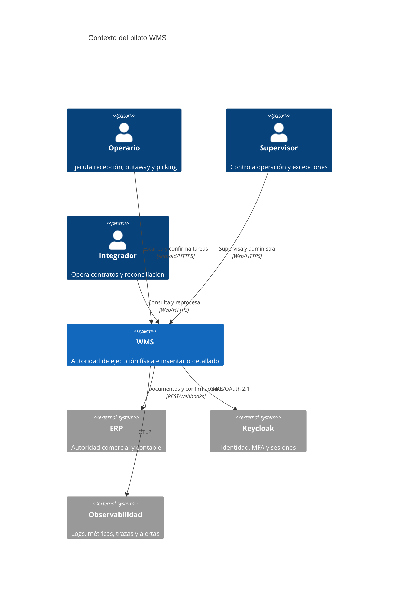
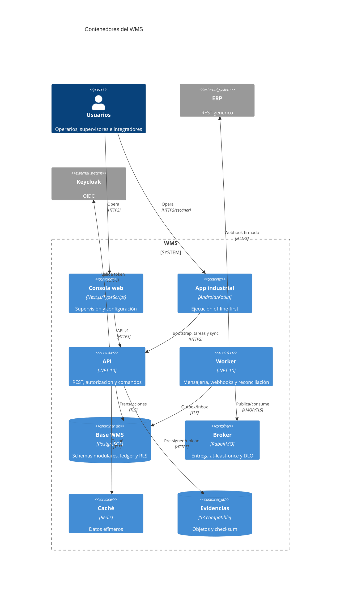
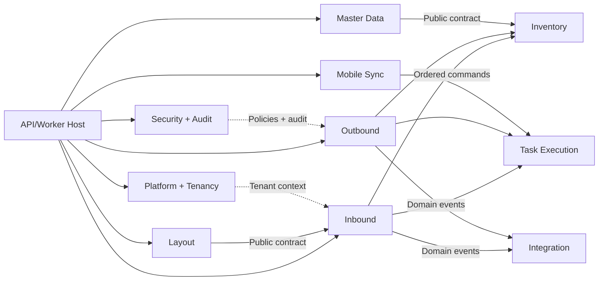

# Diagramas C4

## Nivel 1 — Contexto

## Nivel 2 — Contenedores

## Nivel 3 — Componentes del backend

Las flechas representan contratos públicos, no acceso a tablas. Plataforma y Seguridad son capacidades transversales inyectadas y no “god modules”.
